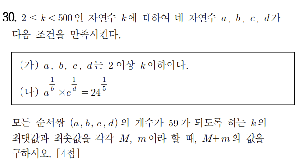

# 수학 영역 (가형) - Mathematics (Type A)

This question is based on a Korean College entrance question
that was mistakenly assigned to highschool-aged teens
due to a mathematical error by the person who created the question.

The original question is:

The translation of the question is:

For a natural number k with 2 ≤ k < 500, four natural numbers (a , b , c , d)
which satisfy the following conditions.

A) **a, b, c, d are greater than or equal to 2 and less than or equal to k.**

B) **a**<math><mfrac><mi>1</mi><mi>b</mi></mfrac></math> *
**b**<math><mfrac><mi>1</mi><mi>c</mi></mfrac></math> =
**25**<math><mfrac><mi>1</mi><mi>5</mi></mfrac></math>

Let M and m be the maximum and minimum values of k, respectively,
so that the number of all ordered pairs (a, b, c, d) is 59.
Find the value of M + m. [4 points]
